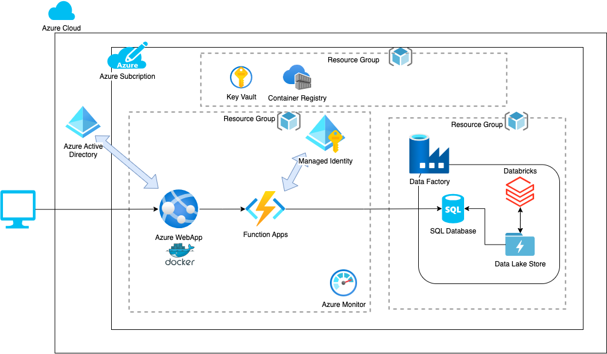
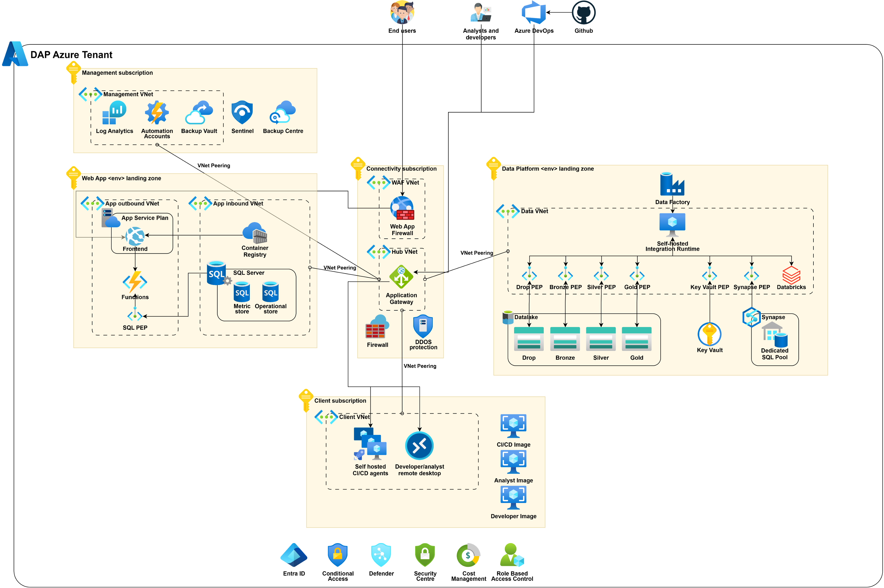

# dhsc-alpha-frontend

## Contents

- [About This Project](#about-this-project)
- [Setup](#setup)
  - [Requirements](#requirements)
    - [Installing project dependencies](#installing-project-dependencies)
- [Usage](#usage)
  - [Running the Application](#running-the-application)
- [Continuous Integration, Development and Deployment](#continuous-integration-development-and-deployment)
  - [CI/CD](#cicd)
- [Further documentation](#further-documentation)
  - [Related Repositories](#related-repositories)

## About This Project

This is the Repo/Code for the DHSC Data Access Platform Frontend. This application primarily utilises the following technologies:

- [React](https://react.dev/)
- [GovUk React](https://govuk-react.github.io/govuk-react/?path=/docs/welcome--docs)
- [Python](https://www.python.org/)
- [Azure](https://azure.microsoft.com/en-gb) - [Web](https://azure.microsoft.com/en-gb/products/app-service/web), [Function App](https://learn.microsoft.com/en-us/azure/azure-functions/functions-overview?pivots=programming-language-csharp) and [Pipelines](https://azure.microsoft.com/en-us/products/devops/pipelines)

With this project we aim to:

- To improve both quality and efficiency of data and insight analysis at a local, regional and national level
- To enable better decision making across all stakeholders to improve the delivery of high-quality care across the sector
- To reduce siloed data sharing and alleviate cost and effort inefficiencies
- To enhance data and insights sharing within the adult social care sector using NHS as a ‘baseline’

## Setup

### Requirements

This project requires the following pre-requisites:

1. [NodeJs](https://nodejs.org/en)
2. [Docker](https://www.docker.com/)
3. [Make](https://makefiletutorial.com/)

#### Installing project dependencies

1. Clone the repo to your chosen directory
2. Navigate to the App directory `cd app`
3. Install dependencies `npm i`

#### Setting up husky pre-commit hooks

1. Navigate to the root of the project
2. Run the command 'make setup-husky' 
3. Linting and Prettier should now run on any staged changes during pre-commit

## Usage

### Running the application

To run the application you must ensure you've followed the setup steps

- To run the app via Docker in the project root directory run: `make docker-up`
- To run the app via Node:
  - Navigate to app directory: `cd app`
  - spin up the application: `npm start`
  - To run tests (_currently there is low test coverage_) `npm test`

## Continuous Integration, Development and Deployment

### CI/CD

This project uses Azure DevOps Pipelines for continuous integration and deployment. There are currently two environments Dev and Production which we continuously integrate with. The CI/CD Pipeline has the following stages:

- Test: This step runs the tests
- Build and Push: This steps builds a docker image and pushes to container registry
- Deploy: This step deploys the application to Azure Web App

## Further documentation

### High Level Architechture Diagram - Alpha 

### Proposed High Level Architechture Diagram - Beta

### Related Repositories

| Name                                                                               | Description                                                                                                                                 |
| :--------------------------------------------------------------------------------- | :------------------------------------------------------------------------------------------------------------------------------------------ |
| [DHSC Alpha Data](https://github.com/madetech/dhsc-alpha-data)                     | Repository for Data work required for DHSC Alpha                                                                                            |
| [DHSC Alpha Infrastructure](https://github.com/madetech/dhsc-alpha-infrastructure) | Infrastructure Repository for the DHSC Alpha Delivery                                                                                       |
| [Govuk React](https://github.com/govuk-react/govuk-react?tab=readme-ov-file)       | An implementation of the [GOV.UK Design System](https://govuk-design-system-production.cloudapps.digital/) in [React](https://reactjs.org/) |
